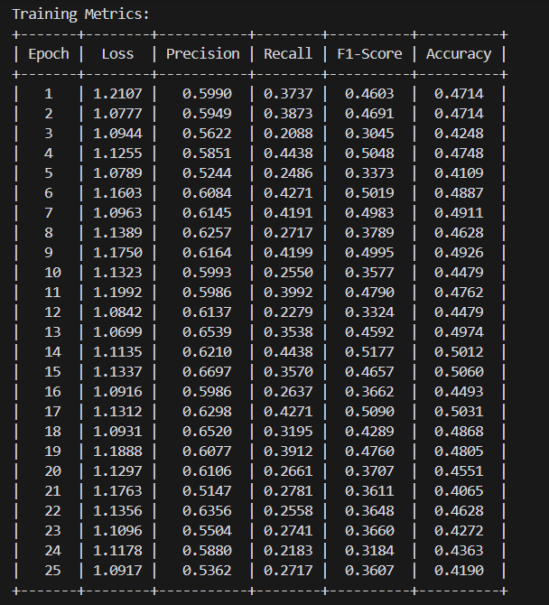
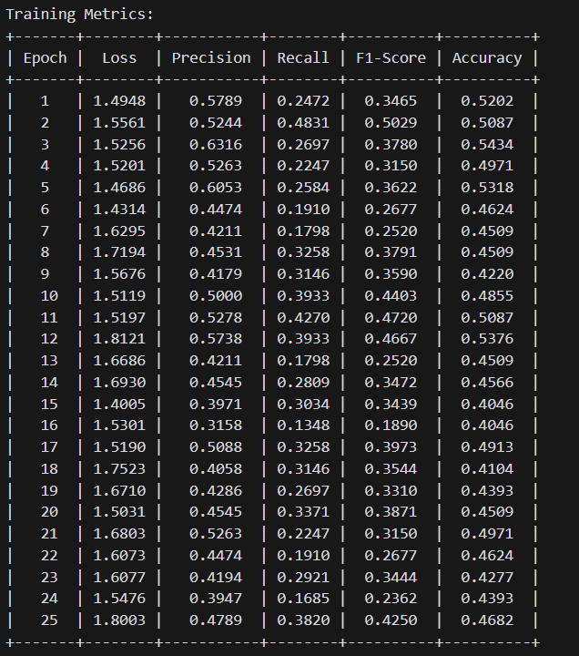

# Video Summarization using PSO

Steps to run the code:

1. Install the dependencies using 
```shell
    pip install -r requirements.txt
```
2. Download the dataset from [here](https://zenodo.org/records/4884870) and put it in the `data` folder
3. Set the `DATA_PATH` in `paths.py` to the path where you put the dataset
4. Also set the `MODEL_PATH` and other paths in `paths.py` to the path where you want to save the trained model and other files respectively
5. Run the `python train.py` script to train the model

**TV_Sum Metrics**


**SumMe_Sum Metrics**


6. Run `generate_summaries.py` to generate the summaries, make sure to change the video path to generate summaries for the video you want.
